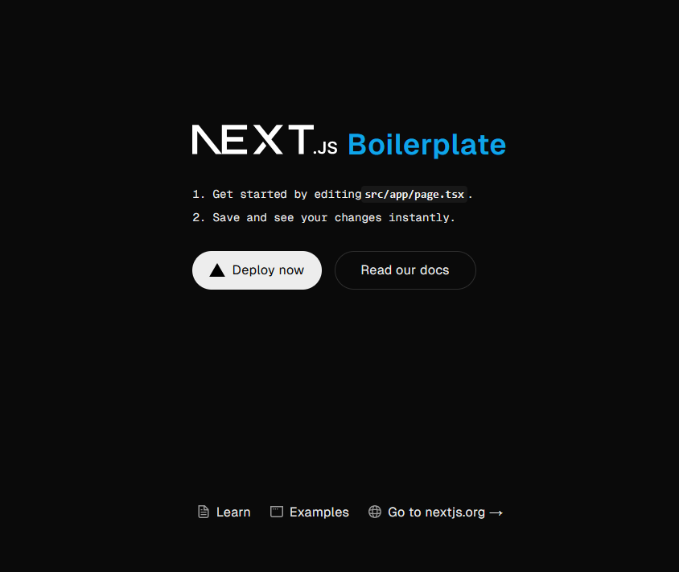

# next-boilerplate



An opinionated boilerplate for NextJS project with minimal setup to get started

## Features

Developer experience first, flexible code structure and only keep what you need:

- ⚡ [Next.js](https://nextjs.org) with App Router support
- 🔥 Type checking [TypeScript](https://www.typescriptlang.org)
- 🎨 Integrate with [Tailwind CSS](https://tailwindcss.com)
- ✅ Strict Mode for TypeScript and React 19
- ⌨️ Form handling with [React Hook Form](https://react-hook-form.com/) for performant, flexible and extensible forms with easy-to-use validation
- 🔴 Validating form inputs made easy with [Zod](https://zod.dev/) a TypeScript-first schema validation with static type inference
- 📏 Linter with [ESLint](https://eslint.org) (default Next.js, Next.js Core Web Vitals, Tailwind CSS). A static code analysis tool for identifying problematic patterns found in JavaScript code.
- 💖 Code Formatter with [Prettier](https://prettier.io)
- 🦊 [Husky](https://typicode.github.io/husky/) for Git Hooks
- 🚫 [Lint-staged](https://github.com/lint-staged/lint-staged) for running linters on Git staged files
- 🚓 Lint git commit with [Commitlint](https://commitlint.js.org/) that helps your team adhere to a commit convention
- 💡 Absolute Imports using `@` prefix, with auto sort/group related imports
- 🗂 VSCode configuration: Settings and Extensions
- 👔 [Stylelint](https://stylelint.io/) a mighty CSS linter that helps you avoid errors and enforce conventions
- 🌏 [Axios](https://axios-http.com/) a promise-based HTTP-client for `node.js` and the `browser` for data fetching
- 🛸 [Tanstack-query](https://tanstack.com/) to make data `fetching`, `caching`, `synchronizing` and `updating` server state in your web applications a breeze
- 💬 [Sonner](https://sonner.emilkowal.ski/) an opinionated toast component for React
- 🌀 [Lucide](https://lucide.dev/) Beautiful & consistent scalable icon
- 🐻 [Zustand](https://zustand.docs.pmnd.rs/getting-started/introduction) for managing state across pages and components
- 🔱 [usehooks-ts](https://usehooks-ts.com/) A set of hooks that enables you to build your React applications faster

Built-in feature from Next.js:

- ☕ Minify HTML & CSS
- 💨 Live reload
- ✅ Cache busting

Things to NOTE:

- This boilerplate is opinionated, allowing you to make any necessary adjustments to suit your requirements and preferences.
- Dependencies are regularly updated
- Free of cost
- Easy to customize
- Minimal code
- SEO-friendly
- Production ready
- Pre-configured data fetching through an Axios wrapper for centralized configuration and error handling
- Pre-configured toast notification
- Out of the box error handler for API error response

### Requirements

- Node.js v18.18.0 or greater and npm

### Getting started

Run the following command on your local environment:

```shell
git clone --depth=1 https://github.com/lyndon-baylin/next-boilerplate.git your-project-name
cd your-project-name
npm install
```

Then, you can run the project locally in development mode with live reload by executing:

```shell
npm run dev
```

Open the `http://localhost:3000` with the browser of your choice to see your project then your good to go for a HAPPY CODING 😄💻

### Development mode commands

Run development server

```shell
  npm run dev
```

Run production server

```shell
  npm run start
```

Build a production script

```shell
  npm run build
```

Code linter for identifying problematic patterns found in JavaScript code

```shell
  npm run lint
```

Code linter for identifying problematic patterns found in JavaScript code and auto fix it if possible

```shell
  npm run lint:fix
```

Code linting for identifying problematic patters found in CSS code

```shell
  npm run lint:css
```

Code linting for identifying problematic patters found in CSS code and auto fix it if possible

```shell
  npm run lint:css:fix
```

Format entire codebase

```shell
  npm run prettify
```

### Code commit

In order to help enforce a consistent commit convention in your project just follow this pattern, where the keyword `chore` is an enum-type [rule](https://commitlint.js.org/reference/rules.html).

```shell
git commit -m "chore: initial commit"
```

Below is the list of enum-type rules and its description

- `build` Changes that affect the build system or external dependencies (example scopes: gulp, broccoli, npm)
- `chore` Other changes that don't modify src or test files
- `ci` Changes to our CI configuration files and scripts (example scopes: Travis, Circle, BrowserStack, SauceLabs)
- `docs` Documentation only changes
- `feat` A new feature
- `fix`  A bug fix
- `perf` A code change that improves performance
- `refactor` A code change that neither fixes a bug nor adds a feature
- `revert` Reverts a previous commit
- `style` Changes that do not affect the meaning of the code (white-space, formatting, missing semi-colons, etc)
- `test` Adding missing tests or correcting existing tests
- `translation` Language translation
- `security` Security fixes
- `changeset` Changeset

### Todo

- Setting up [Vitest](https://vitest.dev/guide/) a test runner framework for unit testing
- Setting up [React Testing Library](https://testing-library.com/docs/react-testing-library/intro/) for testing ReactJS components
- Setting up [Cypress](https://www.cypress.io/) for interactive and realtime integration and end-to-end testing
